# locallibrary diagrams: the player

First run, views, panes, jobs, threads, playback, the queue, deck controls, plugins, dialogs waiting their turn and what it remembers. The rest are listed in the [README](../../README.md#diagrams).

- [Player views](#player-views)
- [First run](#first-run)
- [Prepare view](#prepare-view)
- [Panes and dialogs](#panes-and-dialogs)
- [Jobs list](#jobs-list)
- [Deck layout](#deck-layout)
- [Player threads](#player-threads)
- [Opening a drive in the player](#opening-a-drive-in-the-player)
- [Changing a drive from the player](#changing-a-drive-from-the-player)
- [Dialogs waiting their turn](#dialogs-waiting-their-turn)
- [An unplugged drive in the player](#an-unplugged-drive-in-the-player)
- [Drives view rows](#drives-view-rows)
- [Search and filter](#search-and-filter)
- [Playback](#playback)
- [The queue](#the-queue)
- [Deck controls](#deck-controls)
- [Output devices](#output-devices)
- [Signing in from the player](#signing-in-from-the-player)
- [Plugins in the player](#plugins-in-the-player)
- [Identifying in the Recordings view](#identifying-in-the-recordings-view)
- [What the player remembers](#what-the-player-remembers)

## Player views

The player's five views and what crosses from one to another. `1` to `5` switch views, unless the digits play hot cues (in player mode, or with the pads on, in `:`). "go to the playing track" (in `:`) goes there, in the library or, for a recording, in Recordings; in Recordings with a recording open, "show in library" (in `e`) goes to the selected track in the library.

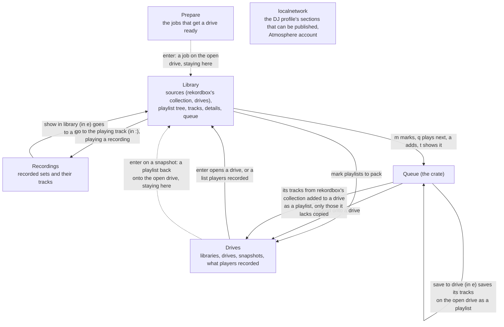
```mermaid
flowchart TD
    library["Library<br/>sources (rekordbox's collection, drives),<br/>playlist tree, tracks, details, queue"]
    prepare["Prepare<br/>the jobs that get a drive ready"]
    drives["Drives<br/>libraries, drives, snapshots, what players recorded"]
    recordings["Recordings<br/>recorded sets and their tracks"]
    publish["localnetwork<br/>the DJ profile's sections that can be published,<br/>Atmosphere account"]
    drives -->|"enter opens a drive, or a<br/>list players recorded"| library
    drives -.->|"enter on a snapshot: a playlist back<br/>onto the open drive, staying here"| library
    prepare -.->|"enter: a job on the open<br/>drive, staying here"| library
    recordings -->|"show in library (in e) goes to a track"| library
    library -->|"go to the playing track (in :),<br/>playing a recording"| recordings
    library -->|"mark playlists to pack"| drives
    library -->|"m marks, q plays next, a adds, t shows it"| crate["Queue (the crate)"]
    crate -->|"save to drive (in e) saves its tracks<br/>on the open drive as a playlist"| crate
    crate -->|"packed onto a drive"| drives
    crate -->|"its tracks from rekordbox's collection added to a drive<br/>as a playlist, only those it lacks copied"| drives
```

Source: [`src/tui/app.rs`](../../src/tui/app.rs), [`src/tui/app/input.rs`](../../src/tui/app/input.rs), [`src/tui/app/library.rs`](../../src/tui/app/library.rs), [`src/tui/app/player.rs`](../../src/tui/app/player.rs), [`src/tui/app/panes.rs`](../../src/tui/app/panes.rs), [`src/tui/keymap.rs`](../../src/tui/keymap.rs), [`src/tui/ui.rs`](../../src/tui/ui.rs), [`src/tui/prepare.rs`](../../src/tui/prepare.rs), [`src/tui/drives.rs`](../../src/tui/drives.rs), [`src/tui/profile.rs`](../../src/tui/profile.rs), [`src/tui/mix.rs`](../../src/tui/mix.rs), [`src/tui/crate_list.rs`](../../src/tui/crate_list.rs)

## First run

What someone new sees. Nothing is said about drives until the first read of them answers, so a drive that's there isn't called missing for a moment.

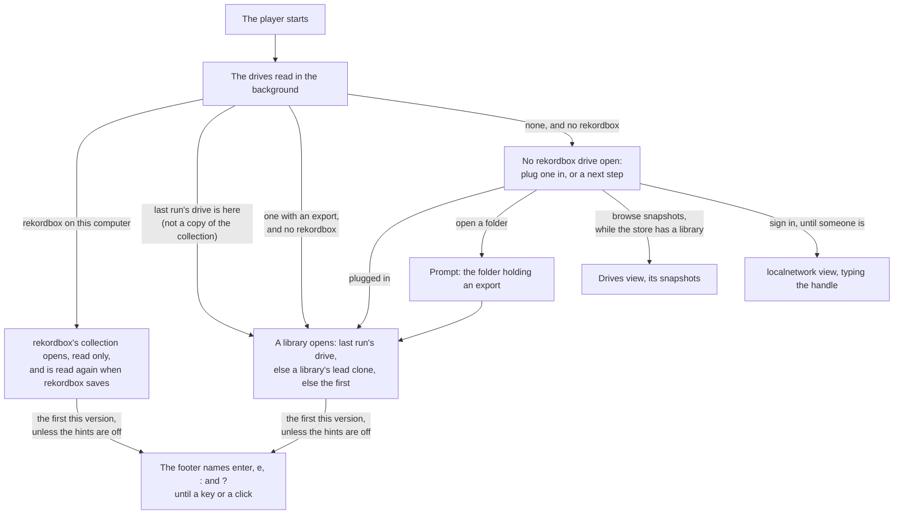
```mermaid
flowchart TD
    start["The player starts"] --> read["The drives read in the background"]
    read -->|"rekordbox on this computer"| collection["rekordbox's collection opens, read only,<br/>and is read again when rekordbox saves"]
    read -->|"last run's drive is here<br/>(not a copy of the collection)"| open["A library opens: last run's drive,<br/>else a library's lead clone, else the first"]
    read -->|"one with an export,<br/>and no rekordbox"| open
    read -->|"none, and no rekordbox"| empty["No rekordbox drive open:<br/>plug one in, or a next step"]
    empty -->|"plugged in"| open
    empty -->|"open a folder"| folder["Prompt: the folder holding an export"]
    folder --> open
    empty -->|"browse snapshots,<br/>while the store has a library"| snapshots["Drives view, its snapshots"]
    empty -->|"sign in, until someone is"| publish["localnetwork view, typing the handle"]
    open & collection -->|"the first this version,<br/>unless the hints are off"| intro["The footer names enter, e, : and ?<br/>until a key or a click"]
```

Source: [`src/tui/first_run.rs`](../../src/tui/first_run.rs), [`src/tui/app/background.rs`](../../src/tui/app/background.rs), [`src/tui/app/drives.rs`](../../src/tui/app/drives.rs), [`src/tui/app/input.rs`](../../src/tui/app/input.rs), [`src/tui/app/mouse.rs`](../../src/tui/app/mouse.rs), [`src/tui/ui/library.rs`](../../src/tui/ui/library.rs), [`src/tui/ui/chrome.rs`](../../src/tui/ui/chrome.rs)

## Prepare view

The jobs that get a drive ready for a set, one row each, on the drive open in the library. Each runs as the palette runs it.

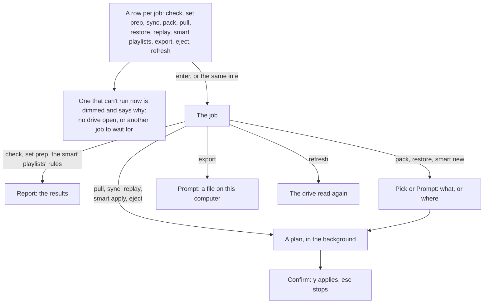
```mermaid
flowchart TD
    rows["A row per job: check, set prep, sync, pack, pull,<br/>restore, replay, smart playlists, export, eject, refresh"]
    rows --> off["One that can't run now is dimmed and says why:<br/>no drive open, or another job to wait for"]
    rows -->|"enter, or the same in e"| run["The job"]
    run -->|"check, set prep, the smart playlists' rules"| report["Report: the results"]
    run -->|"pull, sync, replay,<br/>smart apply, eject"| plan["A plan, in the background"]
    run -->|"pack, restore, smart new"| ask["Pick or Prompt: what, or where"]
    ask --> plan
    run -->|"export"| file["Prompt: a file on this computer"]
    run -->|"refresh"| again["The drive read again"]
    plan --> confirm["Confirm: y applies, esc stops"]
```

Source: [`src/tui/prepare.rs`](../../src/tui/prepare.rs), [`src/tui/keymap.rs`](../../src/tui/keymap.rs), [`src/tui/palette.rs`](../../src/tui/palette.rs), [`src/tui/drives.rs`](../../src/tui/drives.rs), [`src/tui/mytags.rs`](../../src/tui/mytags.rs), [`src/tui/edits.rs`](../../src/tui/edits.rs), [`src/tui/app/input.rs`](../../src/tui/app/input.rs)

## Panes and dialogs

Where keys go in the Library view, and what takes them first, in the order it's asked.

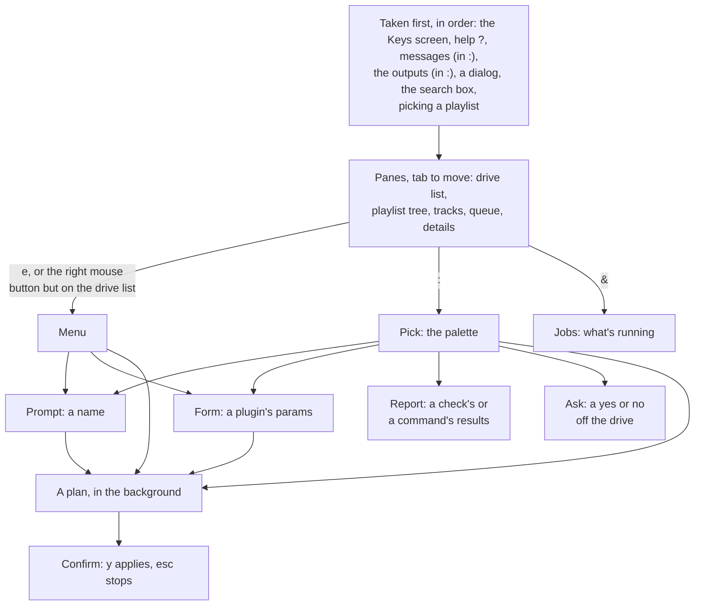
```mermaid
flowchart TD
    first["Taken first, in order: the Keys screen, help ?, messages (in :),<br/>the outputs (in :), a dialog, the search box,<br/>picking a playlist"] --> panes["Panes, tab to move: drive list,<br/>playlist tree, tracks, queue, details"]
    panes -->|"e, or the right mouse<br/>button but on the drive list"| menu["Menu"]
    panes -->|":"| pick["Pick: the palette"]
    panes -->|"&"| jobs["Jobs: what's running"]
    menu --> prompt["Prompt: a name"]
    pick --> prompt
    menu --> form["Form: a plugin's params"]
    pick --> form
    pick --> report["Report: a check's or<br/>a command's results"]
    pick --> ask["Ask: a yes or no<br/>off the drive"]
    prompt --> plan["A plan, in the background"]
    menu --> plan
    pick --> plan
    form --> plan
    plan --> confirm["Confirm: y applies, esc stops"]
```

Source: [`src/tui/app/input.rs`](../../src/tui/app/input.rs), [`src/tui/app/mouse.rs`](../../src/tui/app/mouse.rs), [`src/tui/edits.rs`](../../src/tui/edits.rs), [`src/tui/palette.rs`](../../src/tui/palette.rs), [`src/tui/form.rs`](../../src/tui/form.rs), [`src/tui/jobs.rs`](../../src/tui/jobs.rs), [`src/tui/keymap.rs`](../../src/tui/keymap.rs)

## Jobs list

What `&` lists, and what `enter` does to a row. The status line says what's running from the same rows.

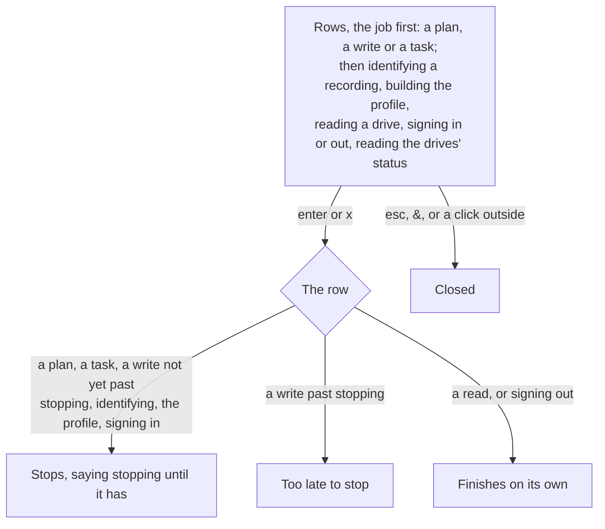
```mermaid
flowchart TD
    rows["Rows, the job first: a plan, a write or a task;<br/>then identifying a recording, building the profile,<br/>reading a drive, signing in or out, reading the drives' status"]
    rows -->|"enter or x"| row{"The row"}
    row -->|"a plan, a task, a write not yet past<br/>stopping, identifying, the profile, signing in"| stopped["Stops, saying stopping until it has"]
    row -->|"a write past stopping"| late["Too late to stop"]
    row -->|"a read, or signing out"| own["Finishes on its own"]
    rows -->|"esc, &, or a click outside"| closed["Closed"]
```

Source: [`src/tui/jobs.rs`](../../src/tui/jobs.rs), [`src/tui/app/input.rs`](../../src/tui/app/input.rs), [`src/tui/app/mouse.rs`](../../src/tui/app/mouse.rs), [`src/tui/edits.rs`](../../src/tui/edits.rs), [`src/tui/account.rs`](../../src/tui/account.rs)

## Deck layout

The Library view's two layouts. In the Deck layout the deck has the screen, as on a CDJ: the digits play hot cues (in Browse over it too) and `enter` plays the pick of what mixes in next. Other views keep the deck strip under them.

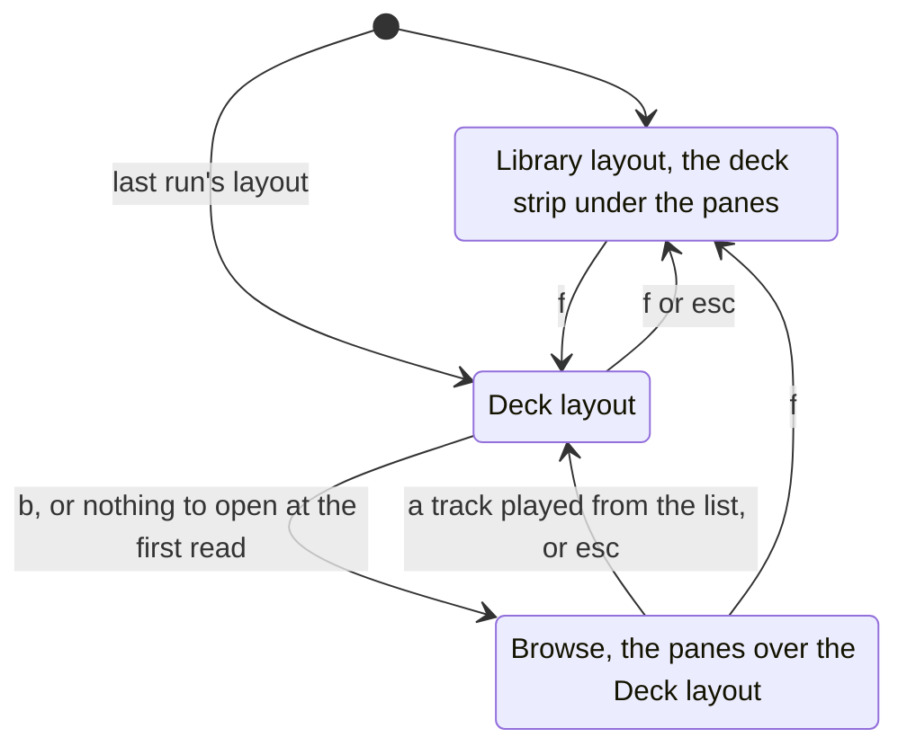
```mermaid
stateDiagram-v2
    state "Library layout, the deck strip under the panes" as Panes
    state "Deck layout" as Deck
    state "Browse, the panes over the Deck layout" as Browse
    [*] --> Panes
    [*] --> Deck: last run's layout
    Panes --> Deck: f
    Deck --> Panes: f or esc
    Deck --> Browse: b, or nothing to open at the first read
    Browse --> Deck: a track played from the list, or esc
    Browse --> Panes: f
```

Source: [`src/tui/deck.rs`](../../src/tui/deck.rs), [`src/tui/app/input.rs`](../../src/tui/app/input.rs), [`src/tui/first_run.rs`](../../src/tui/first_run.rs), [`src/tui/app/saved.rs`](../../src/tui/app/saved.rs), [`src/tui/keymap.rs`](../../src/tui/keymap.rs), [`src/tui/ui.rs`](../../src/tui/ui.rs), [`src/tui/ui/deck.rs`](../../src/tui/ui/deck.rs)

## Player threads

What runs where. Library reads and writes run off the UI thread, with one exception: reviewing a plugin's suggestion about tracks on a drive that isn't open reads it there. At exit the UI thread waits for a write under way.

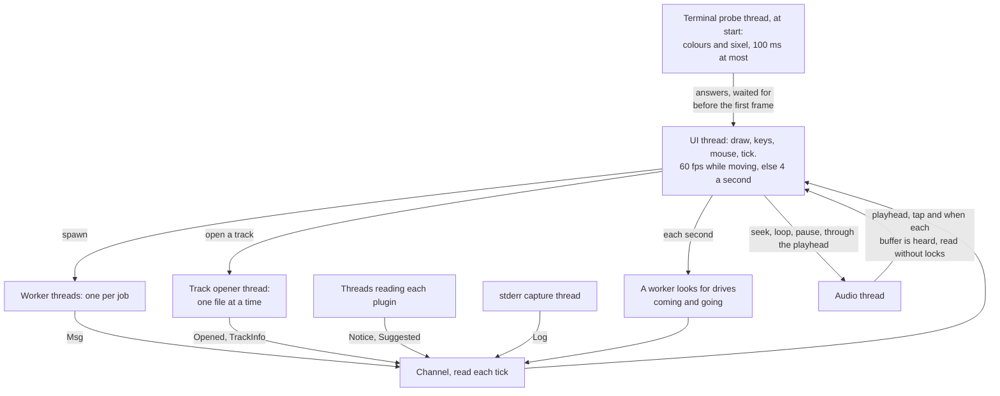
```mermaid
flowchart TD
    loop["UI thread: draw, keys, mouse, tick.<br/>60 fps while moving, else 4 a second"]
    workers["Worker threads: one per job"] -->|"Msg"| channel["Channel, read each tick"]
    opener["Track opener thread:<br/>one file at a time"] -->|"Opened, TrackInfo"| channel
    plugins["Threads reading each plugin"] -->|"Notice, Suggested"| channel
    stderr["stderr capture thread"] -->|"Log"| channel
    channel --> loop
    loop -->|"spawn"| workers
    loop -->|"open a track"| opener
    loop -->|"each second"| poll["A worker looks for drives<br/>coming and going"]
    poll --> channel
    audio["Audio thread"] -->|"playhead, tap and when each<br/>buffer is heard, read without locks"| loop
    loop -->|"seek, loop, pause, through the playhead"| audio
    probe["Terminal probe thread, at start:<br/>colours and sixel, 100 ms at most"] -->|"answers, waited for<br/>before the first frame"| loop
```

Source: [`src/tui/mod.rs`](../../src/tui/mod.rs), [`src/tui/app/background.rs`](../../src/tui/app/background.rs), [`src/tui/app/playing.rs`](../../src/tui/app/playing.rs), [`src/tui/app/input.rs`](../../src/tui/app/input.rs), [`src/tui/audio.rs`](../../src/tui/audio.rs), [`src/tui/stderr.rs`](../../src/tui/stderr.rs), [`src/tui/terminal.rs`](../../src/tui/terminal.rs), [`src/tui/plugins/events.rs`](../../src/tui/plugins/events.rs)

## Opening a drive in the player

The reads a drive starts, each on its own worker. A result for a drive no longer open is dropped.

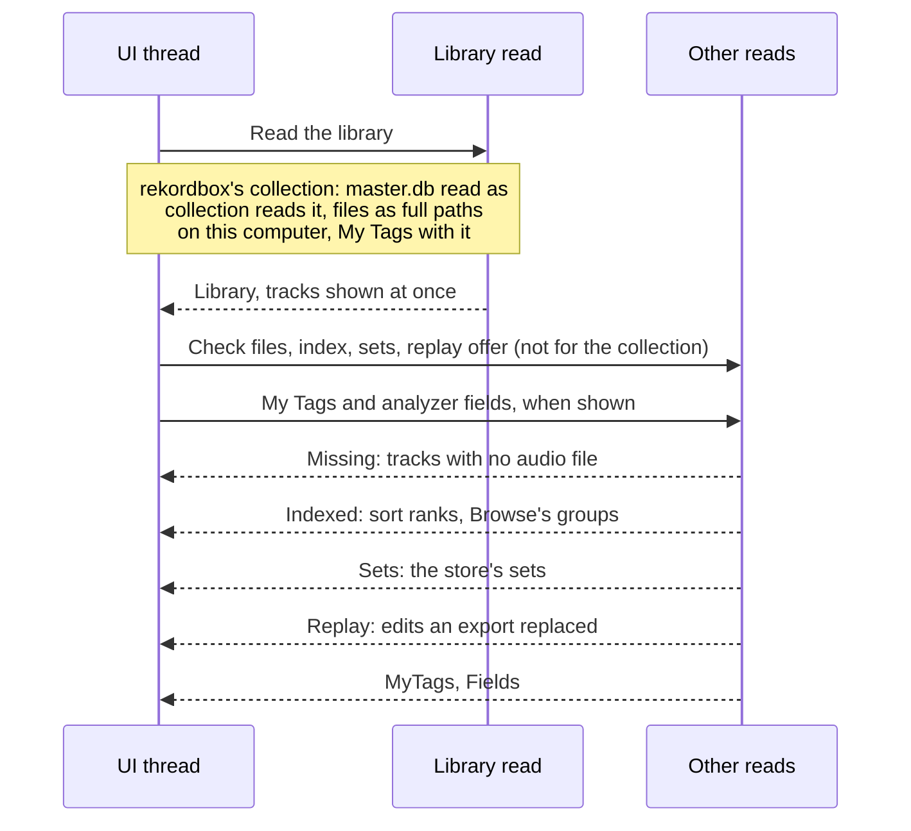
```mermaid
sequenceDiagram
    participant U as UI thread
    participant L as Library read
    participant B as Other reads
    U->>L: Read the library
    Note over U,L: rekordbox's collection: master.db read as<br/>collection reads it, files as full paths<br/>on this computer, My Tags with it
    L-->>U: Library, tracks shown at once
    U->>B: Check files, index, sets, replay offer (not for the collection)
    U->>B: My Tags and analyzer fields, when shown
    B-->>U: Missing: tracks with no audio file
    B-->>U: Indexed: sort ranks, Browse's groups
    B-->>U: Sets: the store's sets
    B-->>U: Replay: edits an export replaced
    B-->>U: MyTags, Fields
```

Source: [`src/tui/app/drives.rs`](../../src/tui/app/drives.rs), [`src/tui/app/library.rs`](../../src/tui/app/library.rs), [`src/tui/app/background.rs`](../../src/tui/app/background.rs), [`src/tui/browse.rs`](../../src/tui/browse.rs), [`crates/loclib-rekordbox-db/src/masterdb.rs`](../../../../crates/loclib-rekordbox-db/src/masterdb.rs)

## Changing a drive from the player

How a change goes from a key to the drive, and when it can still be stopped.

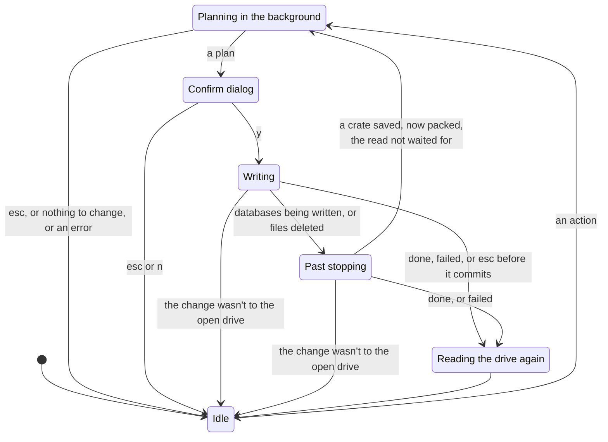
```mermaid
stateDiagram-v2
    state "Planning in the background" as Planning
    state "Confirm dialog" as Confirm
    state "Writing" as Writing
    state "Past stopping" as Committed
    state "Reading the drive again" as Reading
    [*] --> Idle
    Idle --> Planning: an action
    Planning --> Idle: esc, or nothing to change, or an error
    Planning --> Confirm: a plan
    Confirm --> Idle: esc or n
    Confirm --> Writing: y
    Writing --> Committed: databases being written, or files deleted
    Writing --> Reading: done, failed, or esc before it commits
    Writing --> Idle: the change wasn't to the open drive
    Committed --> Idle: the change wasn't to the open drive
    Committed --> Reading: done, or failed
    Reading --> Idle
    Committed --> Planning: a crate saved, now packed,<br/>the read not waited for
```

Source: [`src/tui/edits.rs`](../../src/tui/edits.rs), [`src/tui/app/background.rs`](../../src/tui/app/background.rs), [`src/tui/app/input.rs`](../../src/tui/app/input.rs), [`src/tui/app/drives.rs`](../../src/tui/app/drives.rs), [`src/tui/drives.rs`](../../src/tui/drives.rs)

## Dialogs waiting their turn

What happens to a dialog that work in the background opens while you're busy with something else. It waits in line, so nothing typed for one answers another.

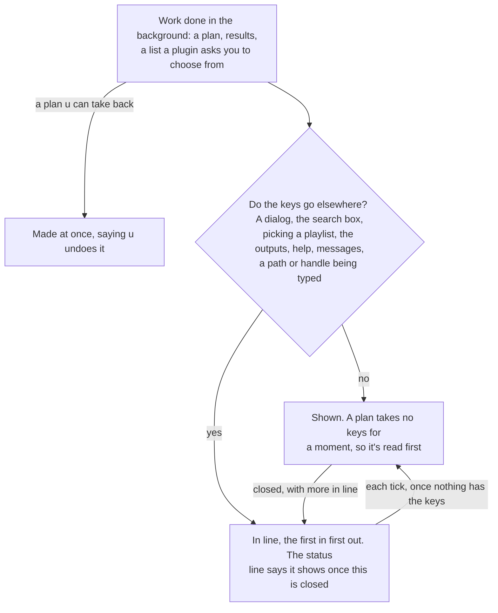
```mermaid
flowchart TD
    job["Work done in the background: a plan, results,<br/>a list a plugin asks you to choose from"]
    job -->|"a plan u can take back"| applied["Made at once, saying u undoes it"]
    job --> taken{"Do the keys go elsewhere? A dialog, the search box,<br/>picking a playlist, the outputs, help, messages,<br/>a path or handle being typed"}
    taken -->|"no"| shown["Shown. A plan takes no keys for<br/>a moment, so it's read first"]
    taken -->|"yes"| waiting["In line, the first in first out. The status<br/>line says it shows once this is closed"]
    waiting -->|"each tick, once nothing has the keys"| shown
    shown -->|"closed, with more in line"| waiting
```

Source: [`src/tui/edits.rs`](../../src/tui/edits.rs), [`src/tui/app.rs`](../../src/tui/app.rs), [`src/tui/app/background.rs`](../../src/tui/app/background.rs), [`src/tui/plugins.rs`](../../src/tui/plugins.rs), [`src/tui/keymap.rs`](../../src/tui/keymap.rs)

## An unplugged drive in the player

What the player does when the open drive goes away. It looks each second.

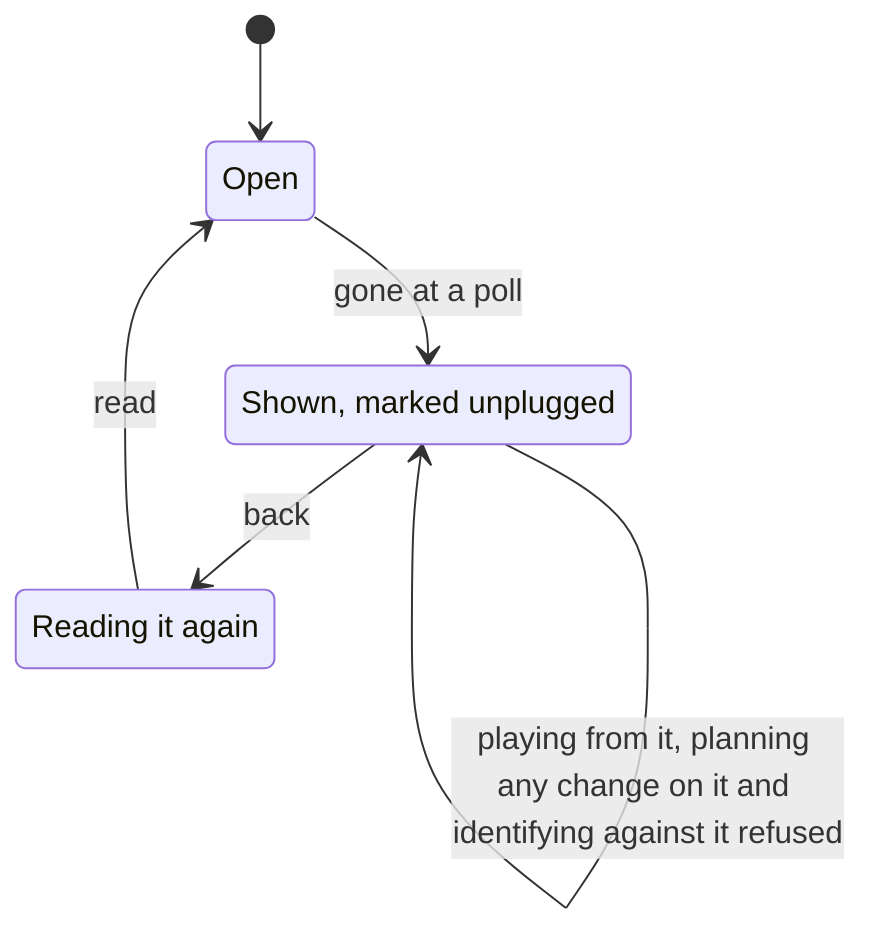
```mermaid
stateDiagram-v2
    state "Open" as Open
    state "Shown, marked unplugged" as Stale
    state "Reading it again" as Reading
    [*] --> Open
    Open --> Stale: gone at a poll
    Stale --> Stale: playing from it, planning any change on it and identifying against it refused
    Stale --> Reading: back
    Reading --> Open: read
```

Source: [`src/tui/app/background.rs`](../../src/tui/app/background.rs), [`src/tui/app/drives.rs`](../../src/tui/app/drives.rs), [`src/tui/app/player.rs`](../../src/tui/app/player.rs), [`src/tui/edits.rs`](../../src/tui/edits.rs), [`src/tui/ui/library.rs`](../../src/tui/ui/library.rs), [`src/tui/drives.rs`](../../src/tui/drives.rs), [`src/tui/mix.rs`](../../src/tui/mix.rs)

## Drives view rows

What each row of the Drives view is, and what `enter` and `e` do on it.

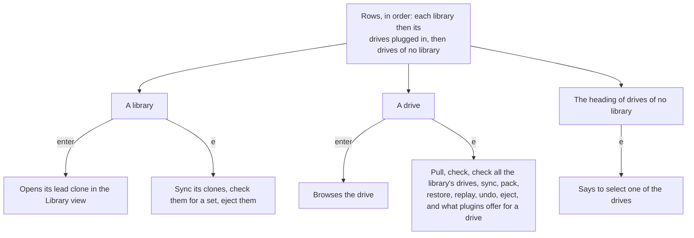
```mermaid
flowchart TD
    rows["Rows, in order: each library then its<br/>drives plugged in, then drives of no library"]
    rows --> library["A library"]
    rows --> drive["A drive"]
    rows --> none["The heading of drives of no library"]
    library -->|enter| open["Opens its lead clone in the Library view"]
    library -->|e| clones["Sync its clones, check them for a set, eject them"]
    drive -->|enter| browse["Browses the drive"]
    drive -->|e| work["Pull, check, check all the library's drives, sync, pack,<br/>restore, replay, undo, eject, and what plugins offer for a drive"]
    none -->|e| select["Says to select one of the drives"]
```

Source: [`src/tui/drives.rs`](../../src/tui/drives.rs), [`src/tui/app/input.rs`](../../src/tui/app/input.rs), [`src/tui/ui/drives.rs`](../../src/tui/ui/drives.rs)

## Search and filter

What the search box does as you type.

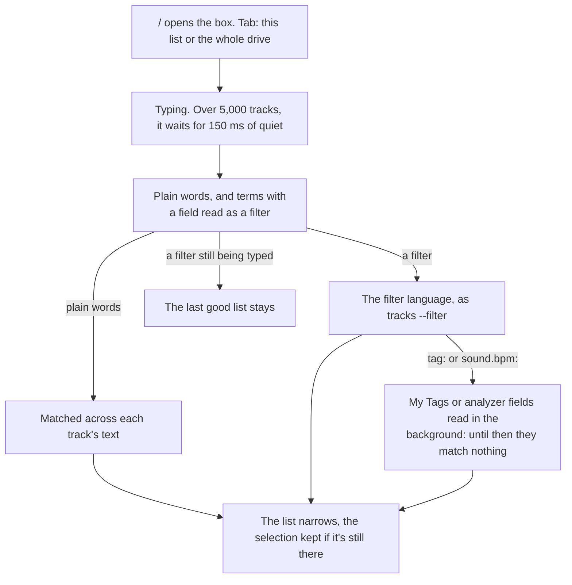
```mermaid
flowchart TD
    slash["/ opens the box. Tab: this list or the whole drive"] --> typed["Typing. Over 5,000 tracks, it waits for 150 ms of quiet"]
    typed --> parse["Plain words, and terms with<br/>a field read as a filter"]
    parse -->|"plain words"| words["Matched across each track's text"]
    parse -->|"a filter"| filter["The filter language, as tracks --filter"]
    parse -->|"a filter still being typed"| last["The last good list stays"]
    filter -->|"tag: or sound.bpm:"| read["My Tags or analyzer fields read in the<br/>background: until then they match nothing"]
    words --> list["The list narrows, the selection kept if it's still there"]
    filter --> list
    read --> list
```

Source: [`src/tui/app/library.rs`](../../src/tui/app/library.rs), [`src/tui/app/input.rs`](../../src/tui/app/input.rs), [`src/tui/browse.rs`](../../src/tui/browse.rs), [`crates/locallibrary/src/query.rs`](../../../../crates/locallibrary/src/query.rs)

## Playback

The path from a file on a drive to the output, and what the UI reads back.

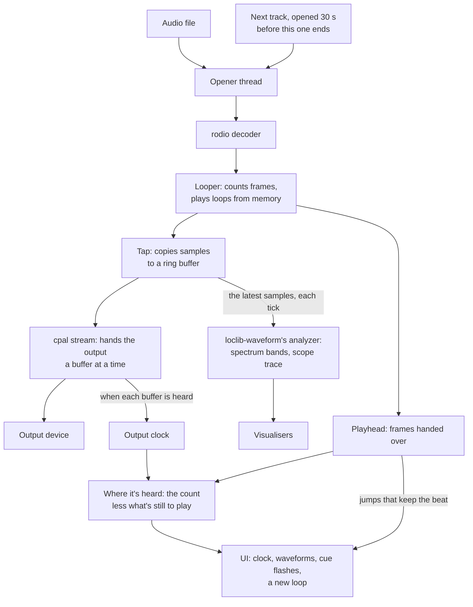
```mermaid
flowchart TD
    file["Audio file"] --> opener["Opener thread"]
    next["Next track, opened 30 s<br/>before this one ends"] --> opener
    opener --> decoder["rodio decoder"]
    decoder --> looper["Looper: counts frames,<br/>plays loops from memory"]
    looper --> tap["Tap: copies samples<br/>to a ring buffer"]
    tap --> stream["cpal stream: hands the output<br/>a buffer at a time"]
    stream --> output["Output device"]
    looper --> playhead["Playhead: frames handed over"]
    stream -->|"when each buffer is heard"| clock["Output clock"]
    playhead --> heard["Where it's heard: the count<br/>less what's still to play"]
    clock --> heard
    heard --> ui["UI: clock, waveforms, cue flashes,<br/>a new loop"]
    playhead -->|"jumps that keep the beat"| ui
    tap -->|"the latest samples, each tick"| analyzer["loclib-waveform's analyzer:<br/>spectrum bands, scope trace"]
    analyzer --> vis["Visualisers"]
```

Source: [`src/tui/audio.rs`](../../src/tui/audio.rs), [`src/tui/audio/output.rs`](../../src/tui/audio/output.rs), [`src/tui/audio/device.rs`](../../src/tui/audio/device.rs), [`src/tui/deck.rs`](../../src/tui/deck.rs), [`crates/loclib-waveform/src/analyzer.rs`](../../../../crates/loclib-waveform/src/analyzer.rs), [`src/tui/app/player.rs`](../../src/tui/app/player.rs), [`src/tui/app/playing.rs`](../../src/tui/app/playing.rs), [`src/tui/ui/player.rs`](../../src/tui/ui/player.rs)

## The queue

What plays next. The picks (`a` and `q`, shown with `t`) come first, then the rest of the list `enter` was pressed in.

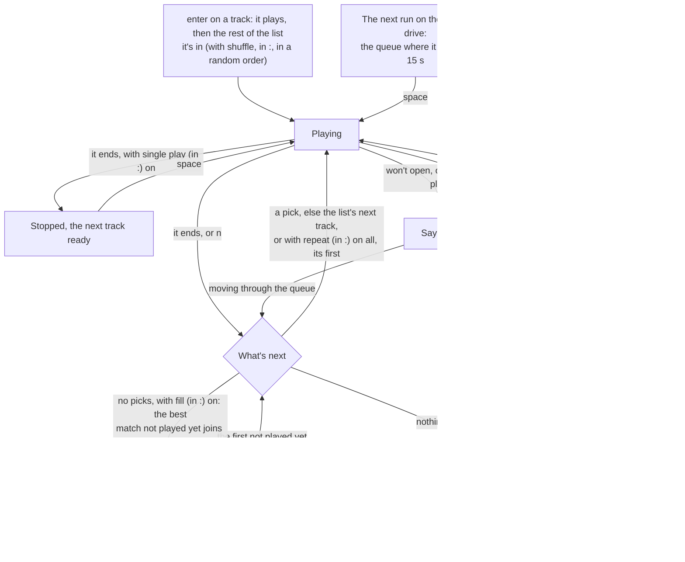
```mermaid
flowchart TD
    enter["enter on a track: it plays, then the rest of the list<br/>it's in (with shuffle, in :, in a random order)"] --> playing["Playing"]
    picks["The picks: a adds to the end, q puts first,<br/>t shows them, shift ↑↓ moves, del takes out"]
    saved["The next run on the same drive:<br/>the queue where it was, to 15 s"] -->|"space"| playing
    playing -->|"it ends, or n"| next{"What's next"}
    picks -->|"the first not played yet"| next
    next -->|"a pick, else the list's next track,<br/>or with repeat (in :) on all, its first"| playing
    playing -->|"it ends, with repeat one<br/>(in :) and no picks"| playing
    next -->|"no picks, with fill (in :) on: the best<br/>match not played yet joins them"| picks
    next -->|"nothing left"| stopped["Stopped"]
    playing -->|"it ends, with single play (in :) on"| ready["Stopped, the next track ready"]
    ready -->|"space"| playing
    playing -->|"won't open, or breaks as it plays"| wont["Says why"]
    wont -->|"moving through the queue"| next
    wont -->|"started with enter, or each track<br/>in turn has failed"| stopped
```

Source: [`src/tui/app/player.rs`](../../src/tui/app/player.rs), [`src/tui/crate_list.rs`](../../src/tui/crate_list.rs), [`src/tui/app/saved.rs`](../../src/tui/app/saved.rs), [`src/tui/app/input.rs`](../../src/tui/app/input.rs), [`src/tui/app/props.rs`](../../src/tui/app/props.rs), [`src/tui/keymap.rs`](../../src/tui/keymap.rs)

## Deck controls

Hot cues, jumps and loops, as on a CDJ. Quantize (in `:`) is on until it's turned off.

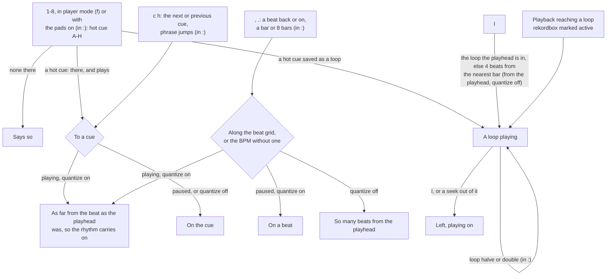
```mermaid
flowchart TD
    pads["1-8, in player mode (f) or with<br/>the pads on (in :): hot cue A-H"]
    pads -->|"none there"| said["Says so"]
    pads -->|"a hot cue: there, and plays"| cue
    marks["c h: the next or previous cue,<br/>phrase jumps (in :)"] --> cue
    beats[", .: a beat back or on,<br/>a bar or 8 bars (in :)"] --> beat
    cue{"To a cue"}
    cue -->|"playing, quantize on"| phase["As far from the beat as the playhead<br/>was, so the rhythm carries on"]
    cue -->|"paused, or quantize off"| exact["On the cue"]
    beat{"Along the beat grid,<br/>or the BPM without one"}
    beat -->|"playing, quantize on"| phase
    beat -->|"paused, quantize on"| landBeat["On a beat"]
    beat -->|"quantize off"| asked["So many beats from the playhead"]
    pads -->|"a hot cue saved as a loop"| looping["A loop playing"]
    loopKey["l"] -->|"the loop the playhead is in, else 4 beats from<br/>the nearest bar (from the playhead, quantize off)"| looping
    active["Playback reaching a loop<br/>rekordbox marked active"] --> looping
    looping -->|"loop halve or double (in :)"| looping
    looping -->|"l, or a seek out of it"| left["Left, playing on"]
```

Source: [`src/tui/deck.rs`](../../src/tui/deck.rs), [`src/tui/deck/tests.rs`](../../src/tui/deck/tests.rs), [`src/tui/app/player.rs`](../../src/tui/app/player.rs), [`src/tui/app/input.rs`](../../src/tui/app/input.rs), [`src/tui/keymap.rs`](../../src/tui/keymap.rs)

## Output devices

The output the player plays through. Opening one never holds up the UI.

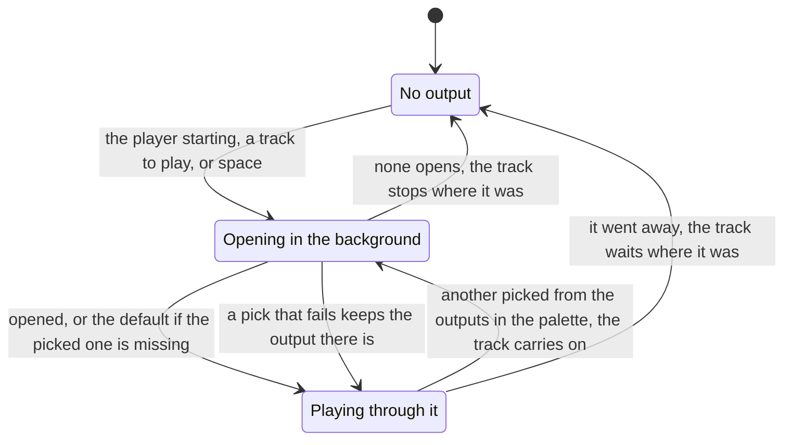
```mermaid
stateDiagram-v2
    state "No output" as None
    state "Opening in the background" as Opening
    state "Playing through it" as Open
    [*] --> None
    None --> Opening: the player starting, a track to play, or space
    Opening --> Open: opened, or the default if the picked one is missing
    Opening --> None: none opens, the track stops where it was
    Open --> Opening: another picked from the outputs in the palette, the track carries on
    Opening --> Open: a pick that fails keeps the output there is
    Open --> None: it went away, the track waits where it was
```

Source: [`src/tui/app/player.rs`](../../src/tui/app/player.rs), [`src/tui/deck.rs`](../../src/tui/deck.rs), [`src/tui/audio.rs`](../../src/tui/audio.rs)

## Signing in from the player

The Atmosphere account's sign-in in the localnetwork view, kept off the UI thread. "sign in/out" (in `e` there, or `:`) starts it, and "sign in", in the empty library or `:`, goes there to start it.

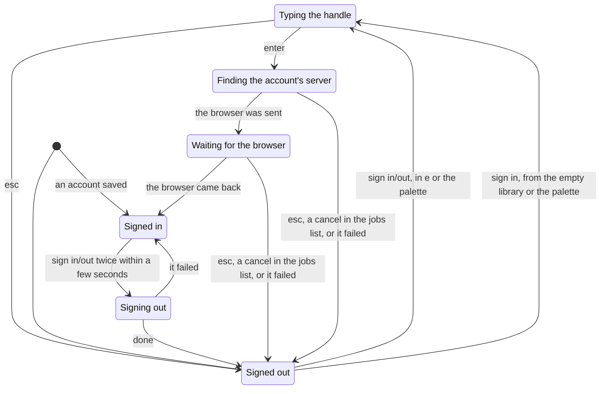
```mermaid
stateDiagram-v2
    state "Typing the handle" as Typing
    state "Finding the account's server" as Starting
    state "Waiting for the browser" as Waiting
    state "Signing out" as SigningOut
    state "Signed in" as In
    state "Signed out" as Out
    [*] --> Out
    [*] --> In: an account saved
    Out --> Typing: sign in/out, in e or the palette
    Out --> Typing: sign in, from the empty library or the palette
    Typing --> Out: esc
    Typing --> Starting: enter
    Starting --> Waiting: the browser was sent
    Starting --> Out: esc, a cancel in the jobs list, or it failed
    Waiting --> In: the browser came back
    Waiting --> Out: esc, a cancel in the jobs list, or it failed
    In --> SigningOut: sign in/out twice within a few seconds
    SigningOut --> Out: done
    SigningOut --> In: it failed
```

Source: [`src/tui/account.rs`](../../src/tui/account.rs), [`src/tui/profile.rs`](../../src/tui/profile.rs), [`src/tui/first_run.rs`](../../src/tui/first_run.rs), [`src/tui/keymap.rs`](../../src/tui/keymap.rs), [`src/tui/jobs.rs`](../../src/tui/jobs.rs)

## Plugins in the player

What a plugin suggests, what it asks of an account, and the panels it adds to a track's details.

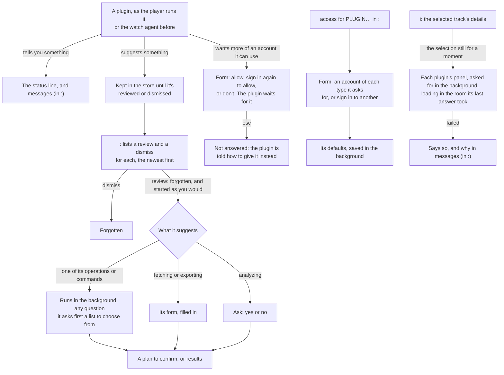
```mermaid
flowchart TD
    plugin["A plugin, as the player runs it,<br/>or the watch agent before"]
    plugin -->|"tells you something"| said["The status line, and messages (in :)"]
    plugin -->|"suggests something"| kept["Kept in the store until it's<br/>reviewed or dismissed"]
    kept --> palette[": lists a review and a dismiss<br/>for each, the newest first"]
    palette -->|"dismiss"| gone["Forgotten"]
    palette -->|"review: forgotten, and started as you would"| what{"What it suggests"}
    what -->|"one of its operations or commands"| run["Runs in the background, any question<br/>it asks first a list to choose from"]
    what -->|"fetching or exporting"| form["Its form, filled in"]
    what -->|"analyzing"| ask["Ask: yes or no"]
    run & form & ask --> result["A plan to confirm, or results"]
    plugin -->|"wants more of an account it can use"| access["Form: allow, sign in again to allow,<br/>or don't. The plugin waits for it"]
    access -->|"esc"| unanswered["Not answered: the plugin is<br/>told how to give it instead"]
    accessFor["access for PLUGIN… in :"] --> choose["Form: an account of each type it asks<br/>for, or sign in to another"]
    choose --> defaults["Its defaults, saved in the background"]
    details["i: the selected track's details"] -->|"the selection still for a moment"| panels["Each plugin's panel, asked for in the background,<br/>loading in the room its last answer took"]
    panels -->|"failed"| failed["Says so, and why in messages (in :)"]
```

Source: [`src/tui/plugins.rs`](../../src/tui/plugins.rs), [`src/tui/plugins/events.rs`](../../src/tui/plugins/events.rs), [`src/tui/plugins/access.rs`](../../src/tui/plugins/access.rs), [`src/tui/plugins/panels.rs`](../../src/tui/plugins/panels.rs), [`src/tui/palette.rs`](../../src/tui/palette.rs), [`src/tui/form.rs`](../../src/tui/form.rs), [`src/tui/keymap.rs`](../../src/tui/keymap.rs)

## Identifying in the Recordings view

What the Recordings view does with a recording, on a worker. An older run's answer is dropped.

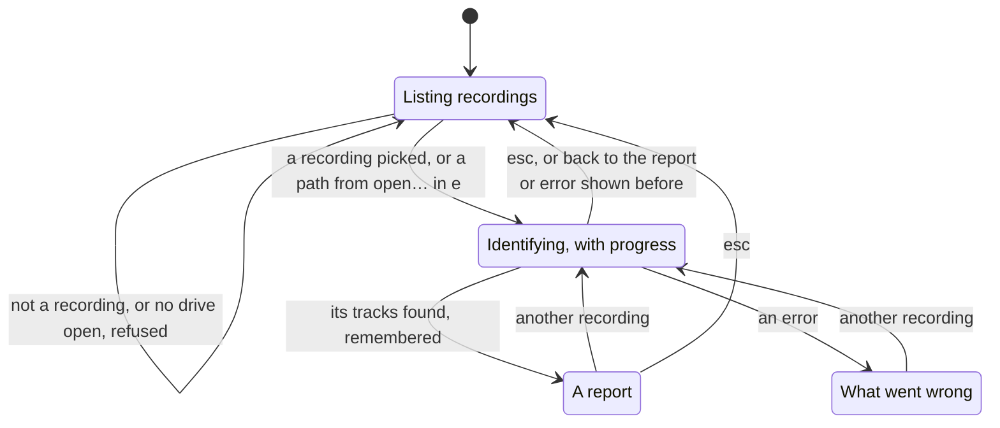
```mermaid
stateDiagram-v2
    state "Listing recordings" as List
    state "Identifying, with progress" as Busy
    state "A report" as Report
    state "What went wrong" as Failed
    [*] --> List
    List --> List: not a recording, or no drive open, refused
    List --> Busy: a recording picked, or a path from open… in e
    Busy --> List: esc, or back to the report<br/>or error shown before
    Busy --> Report: its tracks found, remembered
    Busy --> Failed: an error
    Report --> Busy: another recording
    Failed --> Busy: another recording
    Report --> List: esc
```

Source: [`src/tui/mix.rs`](../../src/tui/mix.rs), [`src/tui/app/background.rs`](../../src/tui/app/background.rs), [`src/tui/app/input.rs`](../../src/tui/app/input.rs)

## What the player remembers

What's saved between runs, and where it goes before there's a store.

```mermaid
flowchart TD
    change["Something changes"] --> check["Checked every 2 s, and on quitting"]
    check --> has{"Where to?"}
    has -->|"a store"| tui["tui.json in the store"]
    has -->|"no store yet"| beside["STORE-player/tui.json,<br/>in a folder beside it"]
    has -->|"inside the open drive (not rekordbox's<br/>collection, open at /), or its file can't be read"| none["Not saved"]
    tui --> where["Where it was: drive, list, view, volume, open panels,<br/>output, player mode, the queue and its picks, recordings and folders opened,<br/>queue and place, the version that last showed the intro"]
    beside --> where
    tui --> prefs["Preferences: theme, colour tier, icons, sort, search scope,<br/>columns, visualiser, playback modes, key notation and colours,<br/>waveform bands, end warning, cover art, hints, recent commands"]
    beside --> prefs
    prefs --> export["settings export"]
    key["A key changed, on the Keys screen<br/>or by an import"] --> keybinds["keybinds.json, beside tui.json, at once;<br/>never over one that can't be read"]
    keybinds --> export
    keybinds -->|"signed in, 2 s after the last change"| record["The account's keybinds record"]
```

Source: [`src/tui/state.rs`](../../src/tui/state.rs), [`src/tui/app/saved.rs`](../../src/tui/app/saved.rs), [`src/tui/first_run.rs`](../../src/tui/first_run.rs), [`crates/locallibrary/src/store.rs`](../../../../crates/locallibrary/src/store.rs), [`crates/locallibrary/src/settings/transfer.rs`](../../../../crates/locallibrary/src/settings/transfer.rs), [`src/tui/keybinds.rs`](../../src/tui/keybinds.rs), [`crates/locallibrary/src/keybinds.rs`](../../../../crates/locallibrary/src/keybinds.rs)
